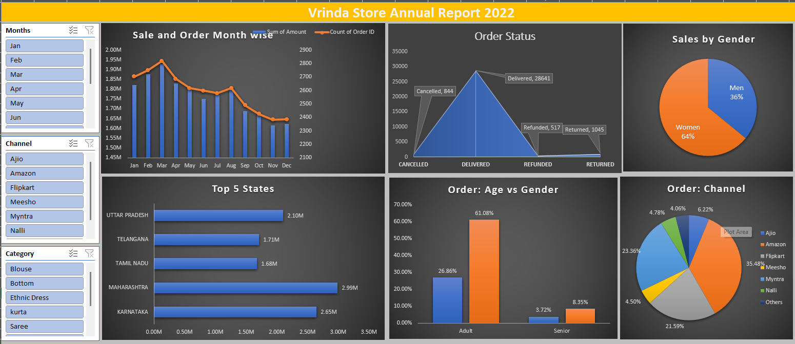

# 📊 Vrinda Store Data Analysis

A Data-Driven Sales Insight & Interactive Excel Dashboard Project

---

## 📁 Overview

This project provides a full sales analysis of **Vrinda Store** using Microsoft Excel. It includes data cleaning, pivot-table analysis, and a professional dashboard with visual insights into customer behavior, state-level performance, sales trends, and order status.

---

## 🎯 Objectives

- Analyze **monthly revenue** & **order trends**
- Compare **gender-based sales contributions**
- Understand **customer age group** demographics
- Identify **top-performing states**
- Evaluate **order delivery vs cancellation** patterns
- Build an **interactive and visually appealing dashboard**
- Provide **actionable insights** for business improvement

---

## 📂 Dataset Structure

| Sheet Name       | Description                        |
|------------------|-------------------------------------|
| Vrinda Store     | Raw data with customer & order details |
| Sales            | Month-wise order & revenue summary    |
| Sales by Gender  | Male vs Female contribution           |
| Order Status     | Delivered, Cancelled, Returned distribution |
| Top 5 States     | Highest revenue-contributing states   |
| Age vs Gender    | Age segmentation of customers         |
| Dashboard        | Final interactive dashboard           |

---

## 🛠 Tools & Techniques Used

- **Microsoft Excel Features**
  - Pivot Tables, Pivot Charts, Slicers
  - Conditional Formatting
  - Data Cleaning (duplicates, formatting, corrections)
  - Dashboard Layout Design

---

## 📈 Key Insights

- **Monthly Sales Performance**
  - Revenue range: ₹17–19 lakh per month
  - March has the highest sales peak
  - Order count matches the revenue trend

- **Gender-Based Insights**
  - Women contribute 64% of total purchases
  - Men contribute 36%
  - Target marketing should focus on women customers

- **Top 5 High-Performing States**
  - Maharashtra
  - Karnataka
  - Uttar Pradesh
  - Telangana
  - Tamil Nadu

- **Order Status Overview**
  - Delivered orders dominate
  - Small percentage of Cancelled & Returned orders
  - E-commerce channel performance aligns with reliability

- **Age Group Insights**
  - Majority of orders are from Adults (30–49 years)
  - This segment drives the highest revenue

---

## 📊 Dashboard Preview

  

---

## 🚀 Conclusion

Vrinda Store's **core customers** are female adults aged 30–49 from major states like Maharashtra, Karnataka, and Uttar Pradesh.  
The dashboard provides clear, interactive visual insights to support business decisions and marketing strategies.

---

## 🔮 Future Enhancements

- Visual Dashboard in **Power BI**
- Predictive sales forecasting with **Python/ML**
- Automated reporting using **Excel Macros** or **Python**
- Customer segmentation using **clustering**

---
